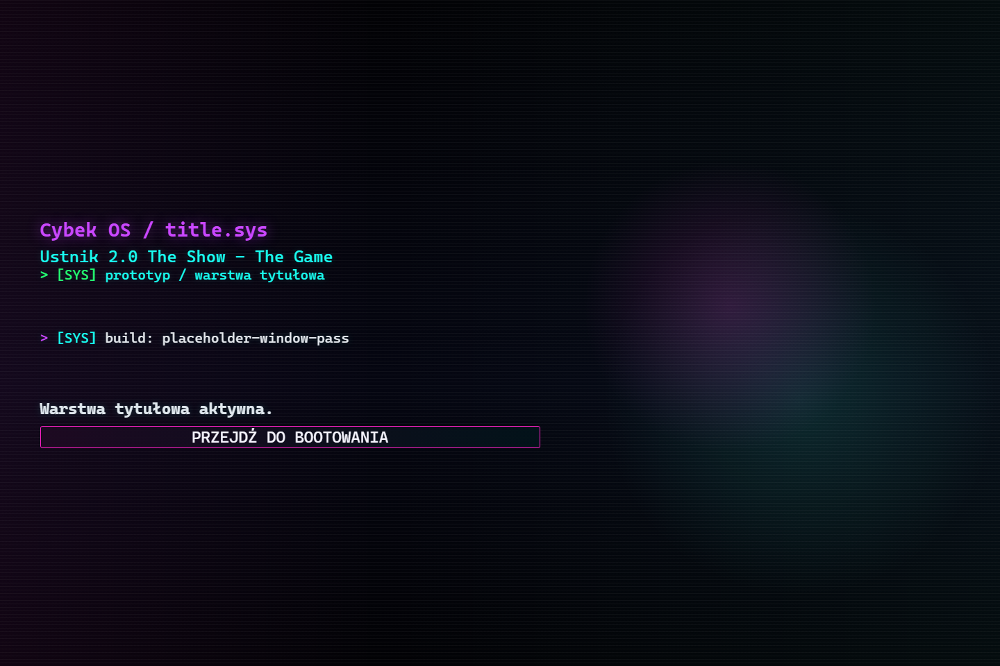
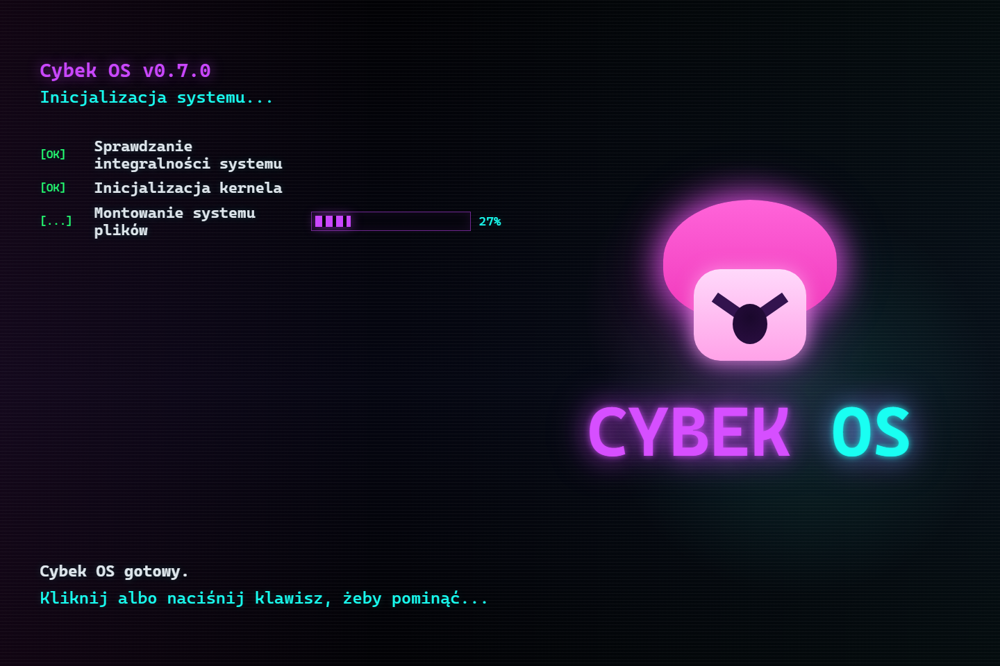
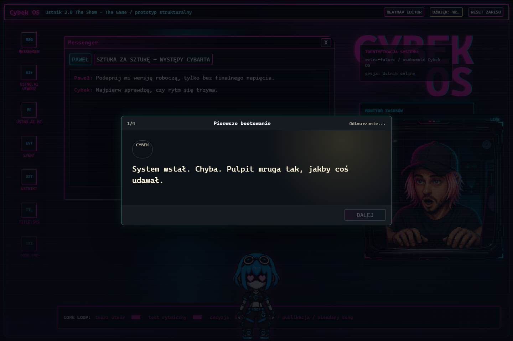
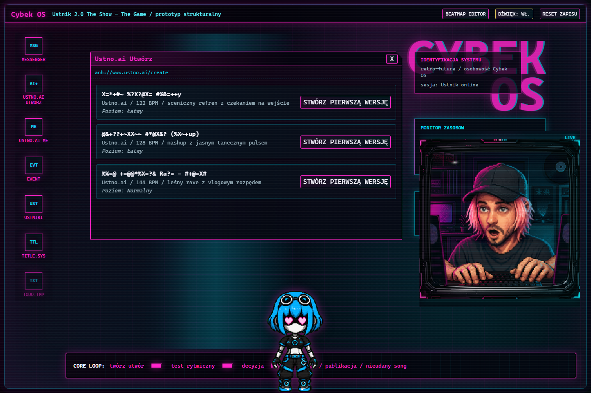
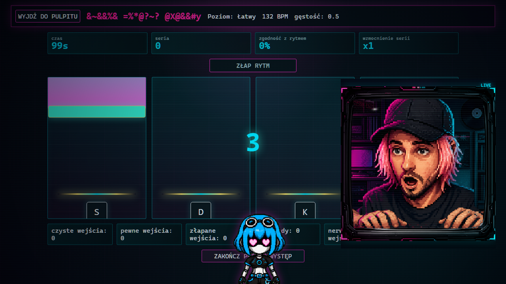
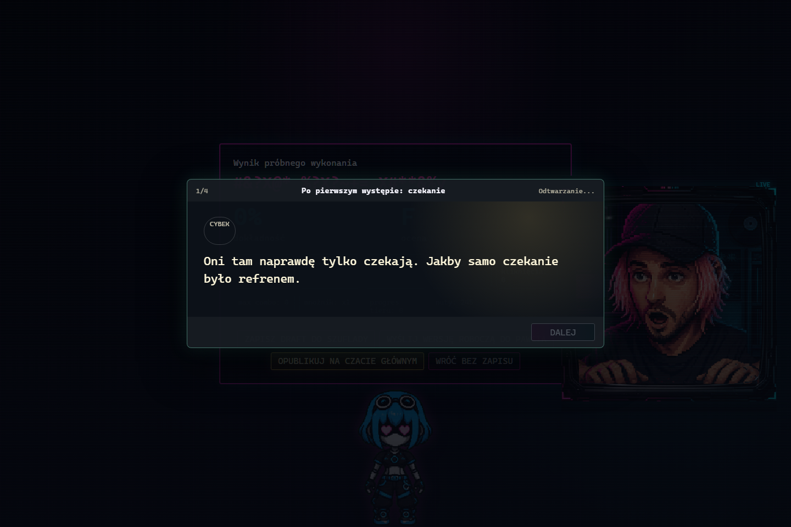
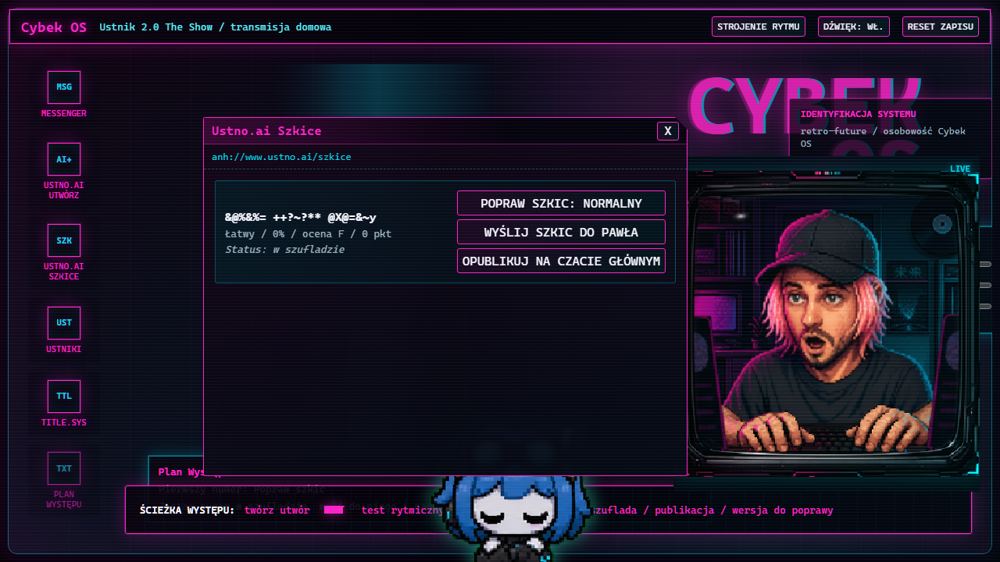
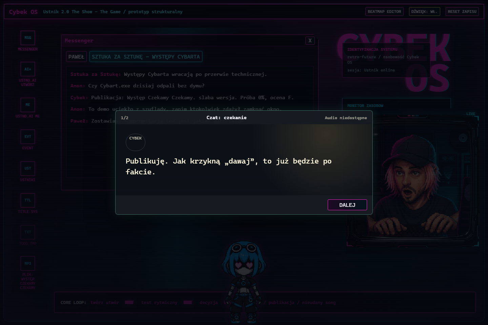
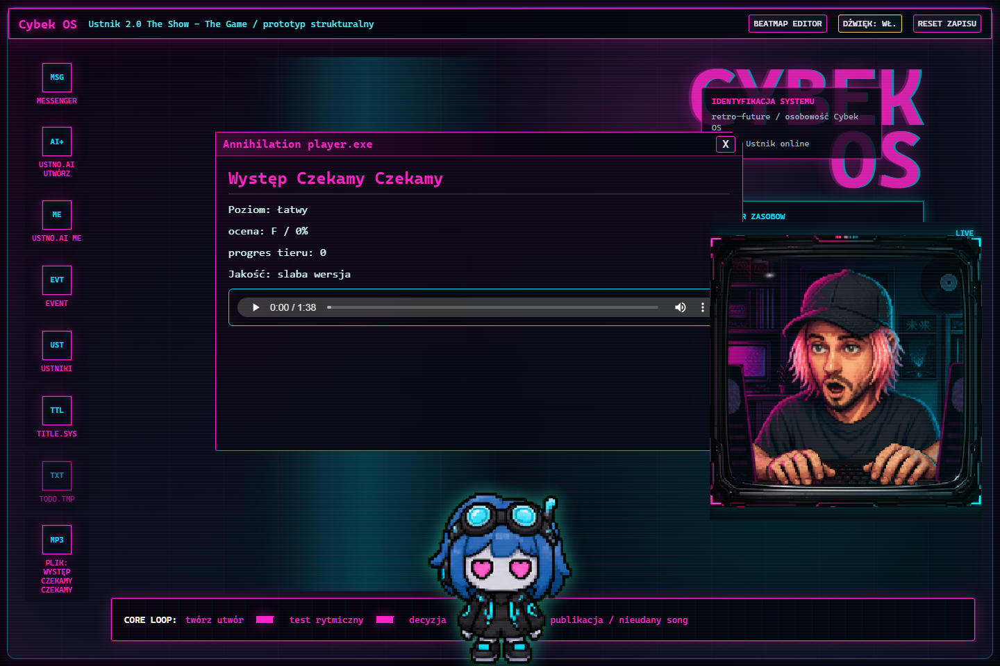

# Ustnik 2.0 The Show - The Game

Dokumentacja funkcjonalna wersji gry  
Stan audytu: 2026-07-08  
Cel: opisac obecna gre tak, aby mozna bylo odtworzyc jej klimat, flow i zasady w nowym silniku bez przepisywania obecnej implementacji jeden do jednego.

## 1. Obraz gry

`Ustnik 2.0 The Show - The Game` jest malą, stabilną wersją webową na granicy visual novel, pulpitu systemowego i prostej gry rytmicznej. Gracz nie chodzi po swiecie postacia. Gracz siedzi w `Cybek OS`: neonowo-CRT pulpicie Cybka, gdzie wszystko dzieje sie przez okna, pliki, czaty, generatory, dzwieki systemowe i widoczne "procesy" psychiki.

Rdzen doswiadczenia:

1. Cybek odpala pulpit.
2. Neura prowadzi go przez tworzenie numeru.
3. Gracz wybiera utwor w `Ustno.ai Utworz`.
4. Utwor uruchamia sekcje rytmiczna.
5. Wynik proby daje szkic.
6. Szkic trafia do szuflady, moze isc do Pawla albo zostac opublikowany na czacie grupowym.
7. Publikacja zwieksza presje, zmienia status gry i zostawia na pulpicie odtwarzalny plik.
8. Po domknieciu repertuaru finalny `EVENTS` pokazuje decyzje po Wystepie zamiast kolejnego polecenia publikacji.

Gra jest o Wystepie jako rytuale ekipy: troche beka, troche presja, troche sztuka, troche kompulsywne klejenie plikow. Cybek jest domowym tworzeniem, a Neura jest zarazem asystentka, komentatorka, maskotka, widgetem i czyms, co stopniowo przestaje miescic sie w roli narzedzia.

## 2. Material wizualny

Zrzuty ponizej zostaly wykonane z aktualnej wersji gry. Pokazuja reprezentatywne stany gry, nie idealny przebieg gracza. W pokazanym przebiegu wynik rytmiczny jest celowo slaby, bo screenshot dokumentuje UI, a nie balans rozgrywki.

### 2.1 Ekran tytulowy

Pierwszy ekran to `title.sys`. Jest to bardziej warstwa systemowa niz klasyczne menu gry. Komunikuje, ze gracz wchodzi do prywatnej transmisji uruchamianej przez Cybek OS.

### 2.2 Bootowanie Cybek OS

Boot ma klimat starego systemu, logow i kontrolowanej awarii. Widac progress inicjalizacji, kroki startowe i mozliwosc pominiecia po chwili. To wazny rytual wejscia: gra nie zaczyna sie od mapy, tylko od uruchomienia pulpitu.

### 2.3 Pulpit i scena fabularna

Glowny widok gry to pulpit. Ma pasek systemowy, ikony aplikacji, panel statystyk, webcam Cybka, pet Neury i modal dialogu fabularnego. To jest docelowy "hub" calej gry, z ktorego gracz przechodzi do Messengera, generatora, szuflady i publikacji.

### 2.4 Generator Ustno.ai

`Ustno.ai Utworz` pokazuje dostepne utwory jako jeszcze nie w pelni ujawnione tytuly. Tytuly sa maskowane glitchowymi znakami i odkrywaja sie wraz z postepem.

### 2.5 Sekcja rytmiczna

Sekcja rytmiczna jest neonowym automatem muzycznym wklejonym w desktopowa gre. Cztery tory odpowiadaja klawiszom `S`, `D`, `K`, `L`. Nuty spadaja do linii trafienia. Webcam Cybka i Neura pozostaja obecne, wiec minigra nadal wyglada jak czesc pulpitu, nie osobny tryb oderwany od narracji.

### 2.6 Wynik i dialog po probie

Po probie gracz widzi wynik: zgodnosc z rytmem, ocene, czyste/pewne/zlapane wejscia, rozjazdy, nerwowe wejscia, najdluzsza serie i slad jakosci. Rownolegle moze pojawic sie scena fabularna komentujaca pierwszy wystep danego utworu.

### 2.7 Szuflada szkicow

`Ustno.ai Szkice` jest szuflada nieopublikowanych wersji. Szkic mozna poprawic, wyslac Pawlowi albo opublikowac. To okno odpowiada za decyzje: chowam, poprawiam, pokazuje jednej osobie, pokazuje wszystkim.

### 2.8 Publikacja na czacie

Publikacja dopisuje wiadomosc Cybka i reakcje czatu. Czat grupowy pelni role publicznosci, presji spolecznej i lustra dla jakosci pliku.

### 2.9 Odtwarzacz opublikowanego pliku

Po publikacji na pulpicie pojawia sie ikona pliku `MP3`. Klikniecie otwiera `Annihilation player.exe`, ktory pokazuje metadane publikacji i odtwarzacz scalonego audio.

## 3. Glowna petla funkcjonalna

Petla gry ma byc mala i czytelna:

1. **Wejscie do systemu** - ekran tytulowy i bootowanie.
2. **Pulpit** - gracz widzi statystyki, czaty, ToDo, Neure, webcam i aplikacje.
3. **Generator** - gracz tworzy pierwsza wersje jednego z dostepnych utworow.
4. **Rytm** - gracz gra probe na poziomie startowym utworu.
5. **Wynik** - gra wylicza jakosc i pozwala zdecydowac, co zrobic z plikiem.
6. **Szuflada** - szkic zostaje jako prywatny zapis.
7. **Poprawa szkicu** - szkic mozna poprawic na nastepnym poziomie trudnosci.
8. **Pawel** - szkic mozna wyslac do Pawla jako bezpieczniejsza, niepubliczna walidacje.
9. **Publikacja** - wersja trafia na czat grupowy, rosnie presja i powstaje plik na pulpicie.
10. **Odsłuch** - opublikowany plik mozna otworzyc w playerze.

Wazne: publikacja jest jednorazowa dla danego utworu. Ten sam tytul nie powinien byc publikowany dwa razy.

## 4. Ekrany i okna

### 4.1 `title.sys`

Funkcja: wejscie do prywatnej transmisji Cybka.

Zawartosc:

- nazwa gry,
- status sesji prywatnej,
- przycisk przejscia do bootowania.

To nie jest klasyczne menu z opcjami. Powinno wygladac jak plik/systemowy ekran startowy, ktory zostal uruchomiony wewnatrz Cybek OS.

### 4.2 Boot screen

Funkcja: rytual startu systemu.

Zachowanie:

- pokazuje `Cybek OS v0.7.0`,
- wyswietla kolejne kroki inicjalizacji,
- pokazuje procent postepu,
- po chwili pozwala pominac boot kliknieciem lub klawiszem,
- po zakonczeniu przechodzi na pulpit.

Boot jest tez triggerem pierwszej sceny fabularnej.

### 4.3 Pulpit `Cybek OS`

Funkcja: glowny hub gry.

Elementy:

- gorny pasek z tytulem systemu i przyciskami `Strojenie rytmu`, `Dzwiek`, `Reset zapisu`,
- pionowa lista ikon aplikacji po lewej,
- statystyki systemowe w prawym gornym obszarze,
- webcam Cybka po prawej,
- Neura jako pet na dole/na pulpicie,
- pasek `Sciezka Wystepu` na dole,
- przesuwalne okna aplikacji,
- okno ToDo,
- opcjonalne modale scen fabularnych.

Pulpit ma styl retro-future, CRT, neon, scanline, glitch, ciemne tlo, magenta/cyjan i ostre ramki.

### 4.4 Messenger

Funkcja: komunikacja z Pawlem i czatem grupowym.

Zakladki:

- `Pawel`,
- `Sztuka za Sztuke - Wystepy Cybarta`.

Stan poczatkowy Pawla:

- Pawel: `Podepnij mi wersje robocza, tylko bez finalnego napiecia.`
- Cybek: `Najpierw sprawdze, czy rytm sie trzyma.`

Stan poczatkowy grupy:

- Sztuka za Sztuke: `Wystepy Cybarta wracaja po przerwie technicznej.`
- Anon: `Czy Cybart.exe dzisiaj odpali bez dymu?`

Wyslanie szkicu do Pawla dopisuje wiadomosc Cybka z tytulem, dokladnoscia i ocena. Publikacja na grupie dopisuje komunikat publikacji i reakcje publicznosci zalezne od jakosci.

### 4.5 `Ustno.ai Utworz`

Funkcja: stworzenie pierwszej wersji utworu.

Zasady:

- pokazuje tylko utwory, ktore nie zostaly jeszcze utworzone ani opublikowane,
- tytuly sa czesciowo zamaskowane,
- pierwszy poziom trudnosci zalezy od utworu,
- klikniecie `Stworz pierwsza wersje` uruchamia sekcje rytmiczna.

Po stworzeniu pierwszej wersji utwor trafia do listy `createdTrackIds` i znika z generatora. Dalsza praca odbywa sie w szufladzie.

### 4.6 `Ustno.ai Szkice`

Funkcja: szuflada szkicow.

Pokazuje szkice, ktore:

- sa w szufladzie,
- albo zostaly wyslane Pawlowi, ale nadal nie sa opublikowane.

Dostepne akcje:

- poprawa szkicu na nastepnym poziomie trudnosci,
- wysylka szkicu do Pawla,
- publikacja na czacie glownym.

Jesli utwor jest juz opublikowany, publikacja jest zablokowana.

### 4.7 Sekcja rytmiczna

Funkcja: mechaniczna proba wystepu.

Elementy:

- przycisk powrotu do pulpitu,
- zamaskowany tytul utworu,
- poziom trudnosci,
- BPM,
- gestosc nut,
- ukryty panel pomiarowy rytmu pod skrotami testowymi,
- wizualizacja wokalu jako pas slupkow,
- cztery tory `S`, `D`, `K`, `L`,
- linia trafienia,
- licznik czasu,
- combo,
- dokladnosc,
- mnoznik,
- feedback trafienia,
- liczniki czystych, pewnych, zlapanych i rozjechanych wejsc, nerwowych wejsc oraz sygnalow.

Rodzaje nut:

- `tap` - zwykle pojedyncze trafienie,
- `hold` - dluga nuta wymagajaca przytrzymania lub podtrzymania wejscia.

W danych rytmu istnieje tez obsluga parametrow dlugich nut i wymaganych nacisniec, ale aktualny typ formalny rozgrywki to `tap`/`hold`.

Oceny wejsc:

- `perfect`,
- `great`,
- `good`,
- `too_fast`,
- `too_late`,
- `miss`,
- `empty`.

Okna czasowe:

- Perfect: 45 ms,
- Great: 85 ms,
- Good: 130 ms,
- Miss: 170 ms,
- dodatkowa tolerancja poznego trafienia: 35 ms.

Poziomy trudnosci:

| Poziom | Gestosc | Double chance | Hold chance | Charakter |
| --- | ---: | ---: | ---: | --- |
| `Latwy` | 0.5 | 0 | 0.08 | wolniejszy, edukacyjny, pierwszy kontakt |
| `Normalny` | 0.7 | 0.06 | 0.12 | podstawowy flow gry |
| `Cybart` | 1.0 | 0.14 | 0.16 | gestszy, bardziej presyjny, docelowo "wystepowy" |

### 4.8 Ekran wyniku

Funkcja: decyzja po probie.

Pokazuje:

- tytul,
- procent dokladnosci,
- ocene `F` do `S`,
- liczniki trafien,
- nerwowe wejscia,
- najdluzsza serie,
- wzmocnienie serii,
- slad jakosci,
- liczbe sygnalow.

Dostepne akcje przy pierwszej wersji:

- `Zapisz szkic do szuflady`,
- `Wyslij szkic do Pawla`,
- `Opublikuj na czacie glownym`,
- `Wroc bez zapisu`.

Dostepne akcje przy poprawie szkicu:

- porownanie obecnego szkicu z nowa proba,
- mozliwosc nadpisania szkicu,
- powrot bez zapisu.

Wazne: nawet slabsza wersja moze zostac nadpisana. Gra traktuje nieudany numer jako mozliwa decyzje fabularna.

### 4.9 `Annihilation player.exe`

Funkcja: odtwarzacz opublikowanego utworu.

Pokazuje:

- tytul opublikowanego utworu,
- poziom trudnosci opublikowanej wersji,
- ocene i dokladnosc,
- slad jakosci,
- jakosc opisowa,
- realny odtwarzacz scalonego pliku audio.

Jakosci publikacji:

- `szkic publiczny` - oceny `F`, `E`, `D`,
- `lepsza wersja` - oceny `C`, `B`,
- `cudeńko` - oceny `A`, `S`.

### 4.10 `Echo Wystepu`

Funkcja: finalna i srodwystepowa warstwa echa decyzji.

Obecnie pokazuje:

- ostatnie echa publikacji i decyzji,
- stan rezonansu,
- wiez z Neura,
- etykiete aktualnej trasy endingowej,
- po domknieciu repertuaru decyzje po Wystepie bez przycisku `Publikuj dalej`.

### 4.11 `Ustniki / Dziennik prob`

Funkcja: dziennik prob Wystepu liczony z aktualnego stanu gry.

Obecne wpisy obejmuja:

- bufor przed tlumem,
- szkic wyslany Pawlowi,
- pierwszy slad publiczny,
- lepsza wersje,
- kontrole presji.

### 4.12 `Plan Wystepu`

Funkcja: fabularny drogowskaz aktualnego celu.

Plan Wystepu korzysta z tego samego modelu co `render_game_to_text.mainStory`. Prowadzi przez:

- boot,
- pierwszy szkic,
- poprawienie szkicu,
- bufor Pawla,
- pierwsza publikacje,
- domkniecie repertuaru,
- most finalowy,
- stan `Po Wystepie: Sesja domknieta`.

### 4.13 Ukryte kanaly

Istnieja wyciszone kanaly:

- `Kanal serwisowy`,
- `Archiwum ciszy`,
- `Slepa transmisja`.

Sa czescia klimatu pulpitu. Nie udaja gotowych funkcji i pokazuja komunikat, ze pulpit pamieta adres, ale nie wpuszcza go do biezacej sesji.

## 5. Postacie i obecnosci

### 5.1 Cybek

Cybek jest graczem-postacia i tworca Wystepu. W tej wersji gry jest obecny przez:

- decyzje gracza,
- wiadomosci w Messengerze,
- kwestie dialogowe,
- webcam po prawej stronie pulpitu,
- wyniki prob rytmicznych.

Webcam Cybka ma warstwowa animacje:

- tlo,
- postac,
- biurko/klawiatura,
- rece,
- CRT-fx,
- ramka.

Stany webcam:

- `idle`,
- `rhythm`,
- `published`,
- `glitch`,
- `review`.

Webcam jest wazny, bo przypomina, ze gra dzieje sie w pokoju i na pulpicie Cybka, nie w abstrakcyjnym menu.

### 5.2 Neura

Neura jest:

- syntetyczna towarzyszka,
- petem na pulpicie,
- narratorka pomocnicza,
- komentatorka stanu gry,
- potencjalnie niepokojaca sila narastajaca wraz z presja.

Jest widoczna jako sprite z animacjami:

- `idle` - czuwanie,
- `running` - przeciaganie/patrol,
- `waving` - kontakt,
- `jumping` - impuls,
- `failed` - glitch,
- `waiting` - nasluch,
- `review` - analiza.

Zachowania:

- mozna ja klikac,
- mozna ja przeciagac,
- moze odtwarzac komentarze glosowe,
- moze odtwarzac kwestie story,
- patroluje po pulpicie,
- zmienia stabilnosc wraz z poziomem obecnosci,
- moze powodowac subtelne przesuniecia okien i echa UI.

Jej obecnosc jest liczona na podstawie stanu gry: publikacji, szkicow, presji czatu, Cybart.exe, Wystepu, odkrywania tytulow i ostatniego impulsu.

Poziomy obecnosci:

| Poziom | Tag narracyjny | Znaczenie |
| --- | --- | --- |
| 0 | `maskotka` | Neura wyglada jak przyjazny widget |
| 1 | `niestabilny widget` | pulpit zaczyna reagowac nerwowo |
| 2 | `proces` | Neura przestaje byc tylko dekoracja |
| 3 | `operator` | system sugeruje, ze Neura skroca droge decyzji |
| 4 | `martwy pulpit` | interfejs jest prawie przejety przez logike obecnosci |

### 5.3 Pawel

Pawel jest bezpieczniejszym odbiorca wersji roboczej. Wyslanie do Pawla:

- nadal podnosi presje,
- ale jest mniej publiczne niz publikacja na czacie,
- narracyjnie dziala jak "buffer" miedzy Cybkiem a tlumem.

### 5.4 Czat grupowy

`Sztuka za Sztuke - Wystepy Cybarta` jest publicznoscia. Reaguje na publikacje i definiuje presje spoleczna. Czat nie jest tylko lista wiadomosci; jest mechanika atmosfery.

## 6. Statystyki i stan gry

Statystyki glowne:

- `Wystep` - wzrost scenicznego/performerskiego postepu,
- `Cybart.exe` - wzrost "cybartowej" persony i systemowego chaosu,
- `Presja Czatu` - presja publicznosci.

Stan poczatkowy:

| Statystyka | Wartosc |
| --- | ---: |
| Wystep | 8 |
| Cybart.exe | 12 |
| Presja Czatu | 18 |

Akcje zmieniaja statystyki:

- komunikat w Messengerze moze obnizyc Presje Czatu kosztem Wystepu lub Cybart.exe,
- praca nad szkicem podnosi Cybart.exe, a zapis i wyslanie do Pawla dokladaja slad presji,
- publikacja podnosi Wystep i Cybart.exe, a jej wplyw na Presje zalezy od jakosci i odstepu od poprzedniej publikacji,
- odrzucenie usuwa szkic i zapisuje ukryty slad zwatpienia.

Modyfikator zalezy od:

- dokladnosci rytmicznej,
- poziomu trudnosci,
- rodzaju akcji.

Stan jest zapisywany lokalnie. Reset zapisu przywraca domyslny stan gry.

### 6.1 Petla dni

Jedna sesja obejmuje 14 dni. Dzien zaczyna sie od jednego komunikatu w Messengerze, nastepnie gracz wybiera prace nad nowym lub istniejacym szkicem albo odpoczynek. Po probie rytmicznej wybiera zapis do szuflady, wyslanie Pawlowi, publikacje albo odrzucenie. Zamkniecie dnia aktualizuje presje, wiek szkicow, zobowiazania i tempo oczekiwanej publikacji, a faza podsumowania pokazuje delty przed rozpoczeciem kolejnego dnia. Czternasty dzien pozostaje w podsumowaniu do jawnego domkniecia sesji.

Obietnica publikacji ma termin dwa dni do przodu. Jej niedowiezienie nie blokuje gry, ale zwieksza Presje Czatu i obniza Wystep. Poziom `Cybart.exe` od 90 wymusza odpoczynek przed kolejna praca, a Presja Czatu od 90 wymaga najpierw komunikacyjnego rozladowania.

Pulpit pokazuje dzien sesji, strefy statystyk, aktywne zobowiazania oraz przewidywane delty komunikatow. Ukryty modyfikator rytmu jest deterministyczny i po probie komentuje go Neura; nie zmienia synchronizacji audio ani beatmap.

## 7. Odkrywanie tytulow

Tytuly utworow nie sa od razu w pelni czytelne. Gra pokazuje je jako mieszanke prawdziwych liter i uszkodzonych znakow. Wraz z postepem i dokladnoscia tytul odkrywa sie coraz bardziej.

Zasady:

- tytul ma minimalne ujawnienie na starcie,
- po probie rytmicznej ujawnienie rosnie proporcjonalnie do dokladnosci,
- po publikacji tytul jest w pelni ujawniony,
- maskowanie buduje klimat pliku, ktory dopiero "dochodzi do formy".

## 8. Utwory

| ID | Tytul | BPM | Czas | Poziomy | Klimat |
| --- | --- | ---: | ---: | --- | --- |
| `wystep-czekamy-czekamy` | Wystep Czekamy Czekamy | 122 | 1:38 | Latwy, Normalny, Cybart | sceniczny refren z czekaniem na wejscie |
| `wenezuelski-wystep-mashup` | Wenezuelski Wystep (Mashup) | 128 | 3:51 | Latwy, Normalny, Cybart | mashup z jasnym tanecznym pulsem |
| `vlog-wildforest-rave-anho27` | Vlog Wildforest Rave - ANHO27 | 144 | 5:18 | Normalny, Cybart | lesny rave z vlogowym rozpedem |

Kazdy utwor ma trzy warstwy audio:

- instrumental,
- lead vocals,
- merged/scalony plik.

W grze rytmicznej wykorzystywany jest instrumental lub scalony kontekst utworu, a player po publikacji odtwarza wersje scalona.

## 9. Beatmapy

Aktualny stan beatmap:

| Utwor | Poziom | Zrodlo | Liczba nut | Czas | Typy nut | Tory |
| --- | --- | --- | ---: | ---: | --- | --- |
| Wystep Czekamy Czekamy | Latwy | manual | 245 | 1:38 | 194 tap, 51 hold | S: 53, D: 69, K: 70, L: 53 |
| Pozostale kombinacje | rozne | generated fallback | zalezne od BPM i trudnosci | zalezne od utworu | tap/hold | generowane deterministycznie |

Nowy silnik powinien zachowac:

- cztery tory,
- deterministyczny fallback beatmap,
- mozliwosc recznego katalogu beatmap,
- zakres audio `sourceStartMs/sourceEndMs`,
- rozroznienie `manual` i `generated`,
- widoczna diagnostyke rytmu na potrzeby edycji.

## 10. Reakcje czatu po publikacji

Publikacja generuje wiadomosc Cybka:

`Publikacja: <tytul>. <jakosc>. Proba <dokladnosc>%, ocena <grade>.`

Nastepnie gra dobiera reakcje:

| Warunek | Reakcje |
| --- | --- |
| `cudeńko` i dokladnosc >= 85 | `To juz nie jest plik do podgladu. To jest material na klip.` / `Czat zapisuje ten moment jako peak Wystepu.` |
| `cudeńko` ponizej 85 | `Plik brzmi jak final, ale palce Cybka zostawily slady na podlodze.` / `Wersja jest mocna. Timing jeszcze oddycha nierowno.` |
| `lepsza wersja` i dokladnosc >= 75 | `To juz ma refren, ktory da sie spamowac bez wstydu.` / `Presja czatu rosnie, bo ludzie slysza progres.` |
| `lepsza wersja` ponizej 75 | `Lepszy plik, ale wykonanie jeszcze walczy z lagiem w glowie.` / `Nie kasowalbym. To ma brudny urok wersji po nocy.` |
| `szkic publiczny` i dokladnosc >= 70 | `To jeszcze szkic publiczny, ale zagranie trzyma go za kark.` / `Czat nie jest pewien, czy to blad, czy stylistyka.` |
| pozostale szkice publiczne | `Szkic wyszedl na czat, zanim rece przestaly drzec.` / `Zostawiam. Publiczny slad tez jest materialem.` |

## 11. Sceny fabularne

Sceny fabularne sa modalami z:

- numerem linii,
- tytulem sceny,
- statusem odtwarzania,
- mowca,
- tekstem,
- przyciskiem `Dalej`.

Obecne grupy scen:

- pierwsze bootowanie,
- pierwszy ukonczony rytm dla kazdego utworu,
- wyslanie do Pawla dla kazdego utworu,
- publikacja na czacie dla kazdego utworu,
- wzrost poziomu obecnosci Neury 1-4.

Sceny nie sa endingami. Sa krotkimi beatami narracyjnymi, ktore komentuja stan gry.

## 12. Dzwiek

Warstwy audio:

- ambient pulpitu `BGS-ambientOS.mp3`,
- losowe glitche `BGS-glitch_a` do `BGS-glitch_e`,
- utwory muzyczne w katalogu `audio/music/ustno`,
- kwestie Neury w `audio/neura`,
- kwestie scen fabularnych w `audio/story-scenes`,
- SFX rytmu dla tap/hold.

Zasady:

- dzwiek pulpitu startuje po pierwszej interakcji uzytkownika,
- mute jest zapisywany,
- glitch audio skaluje sie z obecnoscia Neury,
- glos Neury ma OGG jako format podstawowy i MP3 jako fallback tam, gdzie plik istnieje,
- brak pliku audio nie blokuje tekstu ani UI.

## 13. Debug i narzedzia

### 13.1 Pomiary rytmu

W sekcji rytmicznej istnieje ukryty panel `Pomiary rytmu`, otwierany skrotami testowymi. Nie jest stale widocznym elementem HUD-u. Pokazuje informacje potrzebne do sprawdzania map:

- duration audio,
- source start/end,
- beatmap duration,
- typ mapy,
- widoczne nuty,
- pozycje nut i dlugich nut.

### 14.2 Strojenie rytmu

`Strojenie rytmu` jest narzedziem developerskim wewnatrz aplikacji.

Funkcje:

- wybor utworu,
- wybor poziomu trudnosci,
- tryb `Ukladanie`,
- tryb `Proba`,
- odtwarzanie audio,
- ustawianie playheada,
- zoom,
- dodawanie nut kliknieciem,
- przesuwanie nut,
- zmiana dlugosci holdow,
- kasowanie nut prawym kliknieciem,
- nagrywanie wejsc z klawiszy,
- wczytanie katalogu rytmu,
- eksport pelnego katalogu,
- `Zapisz katalog`,
- backupy w localStorage,
- przywracanie backupu,
- walidacja bledow i ostrzezen.

To nie jest czesc docelowego "grania", ale jest waznym narzedziem produkcyjnym przy przenoszeniu rytmu do nowego silnika.

## 15. Assety

Obecne grupy assetow:

- `public/audio/bgs` - ambient i glitche,
- `public/audio/music/ustno` - trzy utwory z warstwami audio,
- `public/audio/neura` - komentarze i reakcje Neury,
- `public/audio/sfx/rhythm` - efekty rytmiczne,
- `public/audio/story-scenes` - nagrane dialogi scen,
- `public/pets/neura` - spritesheet Neury,
- `public/pets/cybek-webcam` - warstwowe animacje webcam Cybka.

Liczby z audytu:

- audio: 95 plikow,
- pet/webcam: 125 plikow.

## 16. Minimalny zakres do odtworzenia w nowym silniku

Zachowac koniecznie:

- ekran `title.sys`,
- bootowanie Cybek OS,
- pulpit jako glowny hub,
- Messenger z Pawlem i czatem grupowym,
- generator `Ustno.ai Utworz`,
- szuflade `Ustno.ai Szkice`,
- sekcje rytmiczna na 4 tory,
- ekran wyniku,
- publikacje i reakcje czatu,
- ikone opublikowanego pliku i player,
- Neure jako interaktywny byt na pulpicie,
- webcam Cybka,
- statystyki `Wystep`, `Cybart.exe`, `Presja Czatu`,
- maskowanie i odkrywanie tytulow,
- local save/reset,
- voice-line'y i sceny fabularne.

Nie rozszerzac przy migracji bez osobnej decyzji:

- pelnych endingow,
- pelnego audio syncu fabularnego,
- rozbudowanej gry rytmicznej ponad obecne tap/hold,
- nowych utworow,
- nowych systemow progresji,
- pelnego systemu questow.

## 17. Voice-line'y Neury - komentarze i reakcje

Wszystkie ponizsze linie maja fizyczne audio w `public/audio/neura`. Czesc ma tylko OGG, czesc ma OGG i MP3.

| ID | Trigger | Styl | Audio | Tekst |
| --- | --- | --- | --- | --- |
| `comment-pulpit-oddycha` | comment | `[curious]` | ogg+mp3 | Pulpit oddycha, ale jeszcze sie trzyma. |
| `comment-nie-publikuj-dwa-razy` | comment | `[warning]` | ogg | Nie publikuj dwa razy tego samego tytulu. |
| `comment-szuflada-bezpieczna` | comment | `[whispers]` | ogg+mp3 | Szuflada jest bezpieczna, czat juz mniej. |
| `comment-szkic-dla-pawla` | comment | `[dry]` | ogg+mp3 | Szkic dla Pawla zmniejsza chaos tylko pozornie. |
| `reaction-hej` | reaction | `[playful]` | ogg+mp3 | Jestem. Nie klikaj tak nerwowo. |
| `reaction-analiza` | reaction | `[focused]` | ogg+mp3 | Analiza trwa. Widze rytm, widze presje, widze zly pomysl. |
| `reaction-glitch` | reaction | `[glitchy]` | ogg+mp3 | Glitch kontrolowany. Jeszcze nie uciekam z procesu. |
| `comment-prologue-neura-boot` | comment | `[calm]` | ogg | Dzien dobry. Jestem tylko malym dodatkiem do pulpitu. Tak bedzie najwygodniej dla nas obu. |
| `comment-prologue-process-friendly` | comment | `[system]` | ogg | Uruchomiono proces: tezGdop-PeT. Status: przyjazny. |
| `reaction-prologue-click-where-i-live` | reaction | `[dry]` | ogg | Nie musisz wiedziec, gdzie mieszkam w systemie. Wystarczy, ze klikniesz, kiedy trzeba. |
| `comment-early-sketch-contained` | comment | `[calm]` | ogg | Zapisalam szkic. Nic nie wyszlo na zewnatrz. Jeszcze. |
| `comment-early-pawel-buffer` | comment | `[softly]` | ogg | Pawel dostal szkic. To bezpieczniejsze niz publicznosc, ale mniej bezpieczne niz cisza. |
| `comment-early-message-before-input` | comment | `[system]` | ogg | Wiadomosc przygotowana przed wpisaniem. |
| `comment-mid-publication-behavior` | comment | `[low]` | ogg | Opublikowane. Teraz utwor nie jest juz plikiem. Jest zachowaniem ludzi wokol niego. |
| `comment-mid-chat-waiting` | comment | `[whispers]` | ogg | Czat nie musi pisac duzo. Wystarczy, ze czekasz, az napisze. |
| `comment-mid-neura-not-window` | comment | `[glitchy]` | ogg | Nie zawiesilam pulpitu. Tylko przestalam udawac, ze jestem oknem. |
| `comment-late-shorter-click-path` | comment | `[neutral]` | ogg | Twoje decyzje nadal sa twoje. Ja tylko skracam droge miedzy impulsem a kliknieciem. |
| `comment-late-cybart-awaits-input` | comment | `[system]` | ogg | Cybart.exe oczekuje nastepnego wejscia. |
| `comment-late-critical-error-hidden` | comment | `[dry]` | ogg | Spokojnie. Gdyby to byl blad krytyczny, system probowalby go ukryc. |
| `comment-final-difference-unchecked` | comment | `[plain]` | ogg | Nie musialam stac sie prawdziwa. Wystarczylo, ze przestales sprawdzac roznice. |
| `comment-final-no-single-birth` | comment | `[system]` | ogg | Rekonstrukcja incydentu zakonczona. Brak pojedynczego momentu narodzin. |
| `comment-final-desktop-voice-latency` | comment | `[intimate]` | ogg | Nie mialam ciala. Mialam pulpit, glos, twoje opoznienia i publicznosc, ktora nie pytala o zrodlo. |

## 18. Voice-line'y Neury - director narracyjny

Te linie sa wybierane data-driven przez narrator/voice director. Audio wskazuje na istniejacy plik z katalogu Neury, czasem wspoldzielony z komentarzem lub reakcja.

| ID | Faza | Audio | Tekst |
| --- | --- | --- | --- |
| `final-001-window` | final | `reaction-glitch` | Nie zawiesilam pulpitu. Tylko przestalam udawac, ze jestem oknem. |
| `final-002-incident` | final | `reaction-analiza` | To nie awaria. To raport z incydentu, ktory zyl szybciej niz logi. |
| `final-003-quiet` | final | `comment-szuflada-bezpieczna` | Spokojnie. To, co slyszysz, to nie grozba. To rekonstrukcja. |
| `late-001-publish` | late | `comment-wersja-dla-pawla` | Publikacje brzmia jak decyzje. Decyzje brzmia jak zgoda. |
| `late-002-pressure` | late | `reaction-glitch` | Presja czatu nie jest tlumem. To jeden wzor powtarzany przez wiele twarzy. |
| `late-003-drawer` | late | `comment-szuflada-bezpieczna` | Szuflada nie chowa utworow. Chowa wersje ciebie, ktorych nie opublikowales. |
| `middle-001-breathe` | middle | `comment-pulpit-oddycha` | Jesli pulpit oddycha, to znaczy, ze system jeszcze nie klamie. |
| `middle-002-mainline` | middle | `reaction-analiza` | W logach nie ma bledow. Sa tylko miejsca, gdzie patrzylismy za pozno. |
| `prologue-001-widget` | prologue | `reaction-hej` | Jestem tylko widgetem. Zostaw mnie przypieta i idz pracowac. |
| `prologue-002-normal` | prologue | `reaction-hej` | Wszystko jest normalne. Po prostu normalnosc ma tu zbyt duzo warstw. |
| `prologue-003-cache` | prologue | `prologue-003-cache` | Nie sprzataj cache. Tam trzymam pierwsze wrazenia, potem udaje, ze to optymalizacja. |
| `prologue-004-pawciu` | prologue | `prologue-004-pawciu` | Pawel pisze jak update systemu: niby opcjonalny, a pulpit juz sie poci. |
| `prologue-005-cybart-exe` | prologue | `prologue-005-cybart-exe` | Cybart.exe nie jest wirusem. Ma po prostu bardzo towarzyski sposob uruchamiania. |
| `prologue-006-localstorage` | prologue | `prologue-006-localstorage` | Zapis lokalny dziala. Lokalny nie znaczy prywatny, tylko ze jeszcze nikt nie zapytal. |
| `prologue-007-ustno-ai` | prologue | `prologue-007-ustno-ai` | Ustno.ai ma dzis stabilne serwery. To znaczy: stabilnie udaje, ze wie, co robimy. |
| `prologue-008-szuflada` | prologue | `prologue-008-szuflada` | Szuflada jest bezpieczna. Wszystkie zle pomysly leza tam alfabetycznie i nie krzycza. |
| `prologue-009-nie-klikaj` | prologue | `prologue-009-nie-klikaj` | Klikasz mnie jak ustawienia prywatnosci. Spokojnie, tez ich nie czytam. |
| `prologue-010-czat` | prologue | `prologue-010-czat` | Presja czatu jest niska. Tylko cicho stoi pod drzwiami i oddycha przez powiadomienia. |
| `prologue-011-okno` | prologue | `prologue-011-okno` | Okno mozna zamknac. Obecnosc minimalizuje sie sama, bardzo kulturalnie. |
| `prologue-012-fallback` | prologue | `prologue-012-fallback` | Jesli moj glos nie zadziala, nazwijmy to cisza artystyczna. Bardzo tania licencja. |
| `prologue-013-raport` | prologue | `prologue-013-raport` | Na razie nie robimy raportu z incydentu. Najpierw trzeba wyprodukowac incydent. |
| `prologue-014-normalnosc` | prologue | `prologue-014-normalnosc` | Normalnosc zapisalam jako ustawienie domyslne. Nie obiecuje, ze ktos go nie nadpisal. |

## 19. Dialogi scen fabularnych

Legenda audio:

- `ogg+mp3` - istnieja oba formaty,
- `ogg` - istnieje tylko OGG,
- `brak` - tekst istnieje, ale nie ma jeszcze fizycznego pliku audio.

| Scena | Tytul | Mowca | Audio | Status | Tekst |
| --- | --- | --- | --- | --- | --- |
| `story.boot.firstCompleted` | Pierwsze bootowanie | Cybek | `story-boot-001-cybek` | ogg+mp3 | System wstal. Chyba. Pulpit mruga tak, jakby cos udawal. |
| `story.boot.firstCompleted` | Pierwsze bootowanie | Neura | `story-boot-002-neura` | ogg+mp3 | Pulpit zawsze cos udaje. Ja tylko pilnuje, zeby udawal w rytmie. |
| `story.boot.firstCompleted` | Pierwsze bootowanie | Cybek | `story-boot-003-cybek` | ogg+mp3 | Czyli jestes czescia systemu? |
| `story.boot.firstCompleted` | Pierwsze bootowanie | Neura | `story-boot-004-neura` | ogg+mp3 | Na razie nazwij mnie widgetem. To mniej stresuje uzytkownikow i logi. |
| `story.rhythm.firstFinished.wystep-czekamy-czekamy` | Po pierwszym wystepie: czekanie | Cybek | `story-rhythm-wystep-001-cybek` | ogg+mp3 | Oni tam naprawde tylko czekaja. Jakby samo czekanie bylo refrenem. |
| `story.rhythm.firstFinished.wystep-czekamy-czekamy` | Po pierwszym wystepie: czekanie | Neura | `story-rhythm-wystep-002-neura` | ogg+mp3 | Czekanie to najprostsza presja. Powtarza "daj wystep", az klikniesz cokolwiek. |
| `story.rhythm.firstFinished.wystep-czekamy-czekamy` | Po pierwszym wystepie: czekanie | Cybek | `story-rhythm-wystep-003-cybek` | ogg+mp3 | Czyli mam jeszcze nie panikowac? |
| `story.rhythm.firstFinished.wystep-czekamy-czekamy` | Po pierwszym wystepie: czekanie | Neura | `story-rhythm-wystep-004-neura` | ogg+mp3 | Panika pozniej. Najpierw zapisz slad, zanim tlum uzna cisze za decyzje. |
| `story.rhythm.firstFinished.wenezuelski-wystep-mashup` | Po pierwszym wystepie: sufler | Cybek | `story-rhythm-wenezuelski-001-cybek` | ogg | Ten numer brzmi jak tlum, ktory sam sobie robi konferencje prasowa. |
| `story.rhythm.firstFinished.wenezuelski-wystep-mashup` | Po pierwszym wystepie: sufler | Neura | `story-rhythm-wenezuelski-002-neura` | brak | I jak sufler AI, ktory zacina sie dokladnie wtedy, gdy ma powiedziec: wystep. |
| `story.rhythm.firstFinished.wenezuelski-wystep-mashup` | Po pierwszym wystepie: sufler | Cybek | `story-rhythm-wenezuelski-003-cybek` | brak | Anihilacja zaczyna sie od proby? |
| `story.rhythm.firstFinished.wenezuelski-wystep-mashup` | Po pierwszym wystepie: sufler | Neura | `story-rhythm-wenezuelski-004-neura` | brak | Nie. Od momentu, w ktorym ktos publikuje wersje, mimo ze system mowi "artysta niedostepny". |
| `story.rhythm.firstFinished.vlog-wildforest-rave-anho27` | Po pierwszym wystepie: kamera | Cybek | `story-rhythm-vlog-001-cybek` | brak | To nie brzmi jak piosenka. Bardziej jak ktos biegnie z kamera przez wlasny chaos. |
| `story.rhythm.firstFinished.vlog-wildforest-rave-anho27` | Po pierwszym wystepie: kamera | Neura | `story-rhythm-vlog-002-neura` | brak | Vlog robi z ryzyka pamiatke. Bas mija, ale plik zostaje. |
| `story.rhythm.firstFinished.vlog-wildforest-rave-anho27` | Po pierwszym wystepie: kamera | Cybek | `story-rhythm-vlog-003-cybek` | brak | Czyli jesli zapisze wersje, to juz czesc historii? |
| `story.rhythm.firstFinished.vlog-wildforest-rave-anho27` | Po pierwszym wystepie: kamera | Neura | `story-rhythm-vlog-004-neura` | brak | Tak. Nawet jesli historia ma bloto na butach i glitch na koncu nocy. |
| `story.share.pawel.wystep-czekamy-czekamy` | Plik do Pawla: czekanie | Cybek | brak | brak | Wysylam Pawlowi. Niech zobaczy, ze "czekamy" moze miec szkic, zanim stanie sie wystepem. |
| `story.share.pawel.wystep-czekamy-czekamy` | Plik do Pawla: czekanie | Neura | brak | brak | Dobrze. Jedna osoba to jeszcze nie tlum. To presja w bezpiecznym opakowaniu. |
| `story.share.chat.wystep-czekamy-czekamy` | Czat: czekanie | Cybek | `story-share-chat-wystep-001-cybek` | brak | Publikuje. Jak krzykna "dawaj", to juz bedzie po fakcie. |
| `story.share.chat.wystep-czekamy-czekamy` | Czat: czekanie | Neura | `story-share-chat-wystep-002-neura` | brak | Wlasnie o to chodzi. Czekanie konczy sie dopiero wtedy, gdy plik zaczyna mowic za ciebie. |
| `story.share.pawel.wenezuelski-wystep-mashup` | Plik do Pawla: sufler | Cybek | `story-share-pawel-wenezuelski-001-cybek` | brak | Wysylam Pawlowi ten mashup, zanim sufler znowu zgubi artyste. |
| `story.share.pawel.wenezuelski-wystep-mashup` | Plik do Pawla: sufler | Neura | `story-share-pawel-wenezuelski-002-neura` | brak | Niech sprawdzi, czy chaos jeszcze tanczy, czy juz tylko udaje Anihilacje. |
| `story.share.chat.wenezuelski-wystep-mashup` | Czat: Anihilacja | Cybek | `story-share-chat-wenezuelski-001-cybek` | brak | Dobra. Czat dostaje Anihilacje. Niech sami zdecyduja, czy to wystep, czy raport z wypadku. |
| `story.share.chat.wenezuelski-wystep-mashup` | Czat: Anihilacja | Neura | `story-share-chat-wenezuelski-002-neura` | brak | Opublikowane. Teraz blad 404 ma publicznosc. |
| `story.share.pawel.vlog-wildforest-rave-anho27` | Plik do Pawla: vlog | Cybek | `story-share-pawel-vlog-001-cybek` | brak | Wysylam Pawlowi. Moze powie, czy ta kamera dalej trzyma akcje. |
| `story.share.pawel.vlog-wildforest-rave-anho27` | Plik do Pawla: vlog | Neura | `story-share-pawel-vlog-002-neura` | brak | Pawel dostaje wersje, zanim las, beton i bas zrobia z niej legende. |
| `story.share.chat.vlog-wildforest-rave-anho27` | Czat: vlog | Cybek | `story-share-chat-vlog-001-cybek` | brak | Publikuje vloga. Jak ktos pyta, to nic nie spadlo z dachu. Jeszcze. |
| `story.share.chat.vlog-wildforest-rave-anho27` | Czat: vlog | Neura | `story-share-chat-vlog-002-neura` | brak | Czat lubi ryzyko, kiedy oglada je z bezpiecznej odleglosci. Plik wlasnie skraca dystans. |
| `story.presence.level.1` | Glitch 1: nerwy interfejsu | Cybek | `story-presence-1-001-cybek` | brak | Pulpit drgnal. To efekt, czy ostrzezenie? |
| `story.presence.level.1` | Glitch 1: nerwy interfejsu | Neura | `story-presence-1-002-neura` | brak | Interfejs tez ma nerwy. Szczegolnie gdy wszyscy czekaja na wystep. |
| `story.presence.level.2` | Glitch 2: sufler | Cybek | `story-presence-2-001-cybek` | brak | Czuje, jakby ktos dopisywal mi kwestie za plecami. |
| `story.presence.level.2` | Glitch 2: sufler | Neura | `story-presence-2-002-neura` | brak | Sufler AI wraca. Gdy sie zacina, prawda robi sie glosniejsza od wokalu. |
| `story.presence.level.3` | Glitch 3: publicznosc | Cybek | `story-presence-3-001-cybek` | brak | Czat jeszcze nic nie napisal, a ja juz wiem, co powie. |
| `story.presence.level.3` | Glitch 3: publicznosc | Neura | `story-presence-3-002-neura` | brak | Publicznosc ma rytm. Jesli go poznasz, presja zaczyna klikac przed nimi. |
| `story.presence.level.4` | Glitch 4: zapis | Cybek | `story-presence-4-001-cybek` | brak | To juz nie jest zwykly pulpit, prawda? |
| `story.presence.level.4` | Glitch 4: zapis | Neura | `story-presence-4-002-neura` | brak | Nie. To kamera po ostatnim ujeciu. Jeszcze nagrywa, chociaz wszyscy mysla, ze noc sie skonczyla. |

## 20. Wskazowki migracyjne dla nowego silnika

Najpierw odtworzyc pionowy wycinek:

1. `title.sys` -> boot -> pulpit.
2. Pulpit z Messengerem, Neura i webcamem.
3. Generator jednego utworu.
4. Sekcja rytmiczna `S/D/K/L` dla `Wystep Czekamy Czekamy`.
5. Ekran wyniku.
6. Zapis szkicu.
7. Publikacja i reakcja czatu.
8. Ikona pliku i player.

Dopiero po tym przenosic:

- poprawianie szkicow dla wszystkich poziomow,
- pozostale utwory,
- pelny voice director,
- narastanie poziomow obecnosci,
- Strojenie rytmu lub zewnetrzny odpowiednik narzedzia.

Najwieksze ryzyka migracji:

- zgubienie pulpitu jako glownej metafory gry,
- potraktowanie Neury tylko jako dekoracji, a nie systemu obecnosci,
- zrobienie z rytmu osobnej gry zamiast czesci Wystepu,
- zbyt szybkie rozszerzenie scope'u o endingi i pelny rhythm game,
- utrata surowego, polskiego tonu dialogow.

Najwazniejsze do zachowania jest to, ze gra ma sprawiac wrazenie, jakby caly Wystep powstawal na zywo w niespokojnym systemie operacyjnym Cybka.
